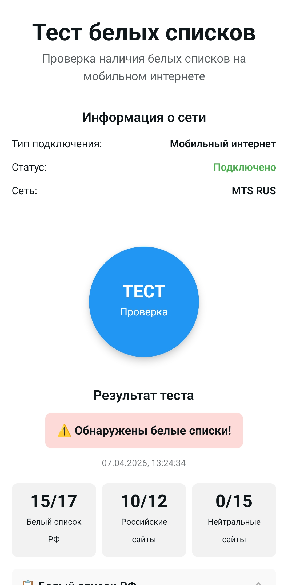
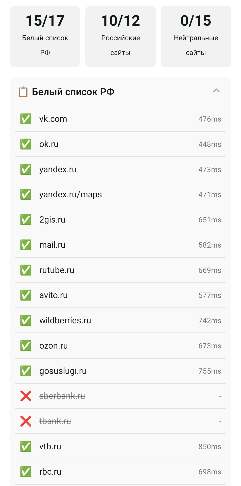
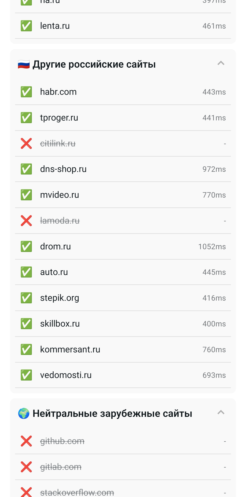

# 📱 Проверка белых списков

Мобильное приложение для проверки белых списков, разработанное на **React Native** с использованием **Expo**.

<p align="center">
  
</p>

## 🚀 Возможности

- ⚡Проверка белых списков по доменам
- 🎨 Современный интерфейс с навигацией
- ⚡ Оптимизированная производительность

## 📦 Релиз

🔗 **[Последний релиз](../../releases/latest)** — скачайте последнюю стабильную версию

### История версий

Все релизы доступны в разделе [Releases](../../releases).

## 📦 Установка

1. Клонируйте репозиторий:

```bash
git clone <URL_РЕПОЗИТОРИЯ>
cd testwhitelist
```

2. Установите зависимости:

```bash
npm install
```

3. Запустите приложение:

```bash
npx expo start
```

## 📱 Запуск на устройствах

### Android

```bash
npm run android
```

### iOS

```bash
npm run ios
```

## 🏗 Структура проекта

```
testwhitelist/
├── app/              # Экраны и маршруты (Expo Router)
├── assets/           # Изображения, шрифты и ресурсы
├── components/       # Переиспользуемые компоненты
├── constants/        # Константы и конфигурация
├── hooks/            # Пользовательские хуки
└── scripts/          # Вспомогательные скрипты
```

## 📸 Скриншоты

<p align="center">
  
</p>

<p align="center">
  
</p>

## 🤝 Вклад

Приветствуется любой вклад в проект! Для начала:

1. Сделайте форк репозитория
2. Создайте ветку для новой функциональности
3. Зафиксируйте изменения
4. Отправьте в ветку
5. Откройте Pull Request

## 📄 Лицензия

Этот проект распространяется под лицензией **MIT**.

Лицензия разрешает:

- ✅ Коммерческое использование
- ✅ Модификацию кода
- ✅ Распространение
- ✅ Частное использование

Единственное требование — **сохранение уведомления об авторских правах** и текста лицензии в копиях проекта.

## 📞 Контакты

Если у вас возникли вопросы или предложения:

- Напишите на email: <nederlandalekseykon@gmail.com>

---

⭐ Если проект был полезен, поставьте звезду!
