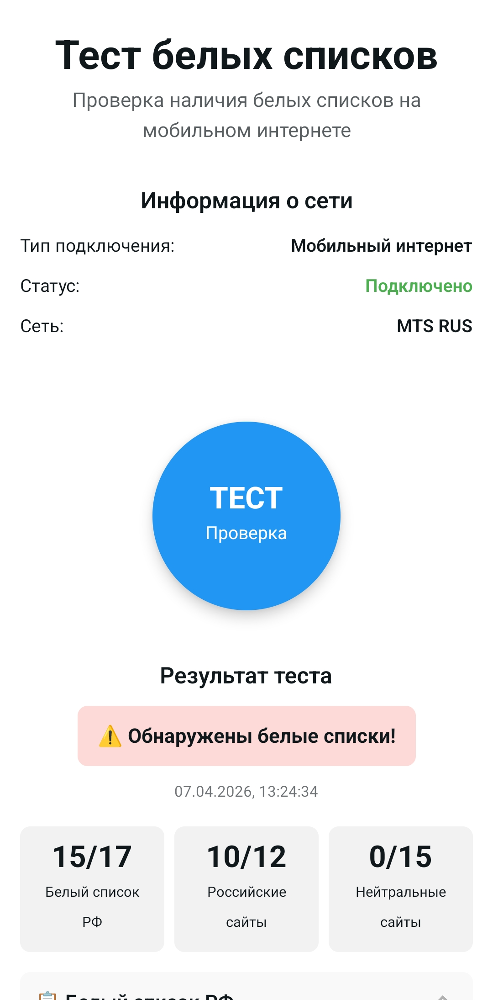
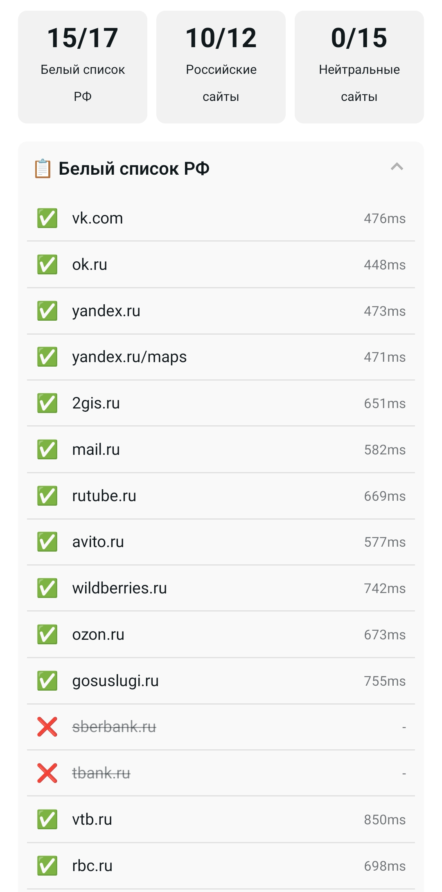
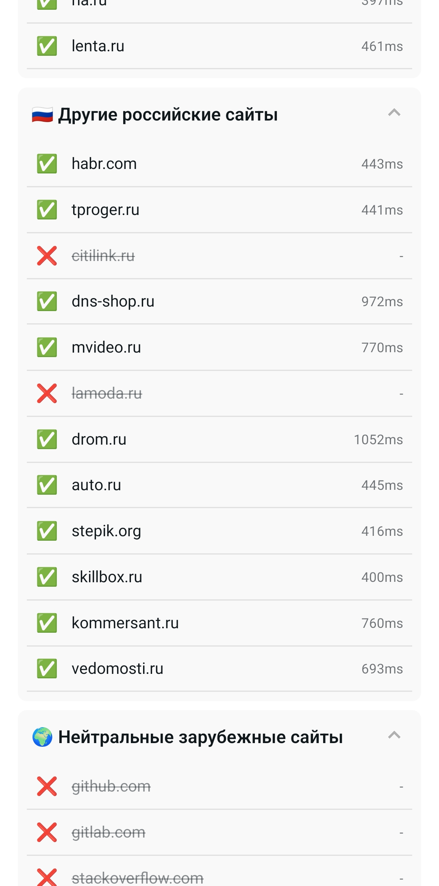

# 📱 Проверка белых списков

Мобильное приложение для проверки белых списков, разработанное на **React Native** с использованием **Expo**.

<p align="center">
  
</p>

## 🚀 Возможности

- ⚡Проверка белых списков по доменам
- 🎨 Современный интерфейс с навигацией
- ⚡ Оптимизированная производительность
- 🌐 Русский и английский интерфейс: при первом запуске язык системы `ru` включает русский, любой другой — английский. Переключатель RU / EN справа сверху сохраняет выбор для следующих запусков и фоновых уведомлений.
- ☀️ Кнопка слева от языков переключает светлую и тёмную темы после вращения иконки. Выбор сохраняется; до первого переключения используется тема системы. При включённом уменьшении движения тема меняется без анимации.

Локализация использует `expo-localization`. После обновления зависимостей пересоберите
установленную Android/iOS-версию, чтобы подключить нативный модуль.

Тема Android-заставки синхронизируется через локальный модуль `modules/app-theme`.
После его добавления и изменения цветов заставки в `app.json` нужна новая нативная сборка.
Android 12+ сохраняет выбор для системной заставки следующего запуска; при обновлении
со старой версии выбор переносится при первом запуске. На старых Android тема
восстанавливается при создании приложения; самый ранний системный кадр запуска может
следовать теме телефона. На iOS системная заставка следует теме iOS, а сохранённая
тема приложения применяется до показа интерфейса React.

## 📦 Релиз

🔗 **[Последний релиз](../../releases/latest)** — скачайте последнюю стабильную версию

### История версий

Все релизы доступны в разделе [Releases](../../releases).

## 📦 Развертывание

1. Клонируйте репозиторий:

```bash
git clone https://github.com/Aleksey-Kon/white-list-test.git
```
```bash
cd testwhitelist
```

2. Установите зависимости:

```bash
npm install
```

3. Запустите приложение:

```bash
npx expo start
```

## 📱 Запуск на устройствах

Размер release APK уменьшен с 108,81 до 54,83 МиБ сжатием нативных библиотек
с сохранением всех архитектур. [Измерения и проверки содержимого](docs/apk-size-optimization.md).

### Проверка сайтов с ошибками сертификатов

Локальный Expo-модуль `modules/site-probe` выполняет запросы пингера на Android/iOS
с принятием просроченных, самоподписанных и не соответствующих имени сайта
сертификатов. Доступность определяется полученным HTTP-статусом по прежним правилам;
ошибка DNS, таймаут или обрыв соединения не считаются успешной проверкой.
Проверка работает и в фоновом мониторинге. Клиент получает только статус ответа,
не использует общие cookies или хранилище авторизации и не загружает тело страницы.

Редирект (`301`, `302`, `307` и т. п.) считается ответом сайта: пингер не переходит
по нему. Это предотвращает ложную недоступность при циклах перенаправлений
(например, Ozon без браузерных cookies) и ошибках на следующем адресе.
Проверяется ответ исходного сайта, а не успешное открытие конечной страницы.

После этого изменения нужна новая нативная сборка: перезапуска Metro недостаточно.
В Expo Go и старых сборках остаётся обычный `fetch`; браузерная версия также
не может обходить проверку сертификатов. Дополнительные npm-зависимости не нужны.

Плагин `plugins/withSiteProbe.js` разрешает ручную проверку доверия на iOS через
`NSAllowsArbitraryLoads` (ATS отключается на уровне приложения, поскольку домены
задаёт пользователь). Принятие недействительных сертификатов реализовано только
в отдельном `URLSession` пингера; обычные сетевые клиенты сохраняют проверку доверия.
См. [документацию Apple](https://developer.apple.com/documentation/foundation/performing-manual-server-trust-authentication).

Проверка на установленной сборке: добавить `https://expired.badssl.com`,
`https://self-signed.badssl.com` и `https://wrong.host.badssl.com` и выполнить тест
в сети без блокировок. Все три должны получить HTTP-ответ. Затем отключить сеть:
сайты должны стать недоступны. Повторить для фонового мониторинга. Эти проверки
нужны отдельно от Node-тестов, которые мокируют нативный транспорт.

### Фоновый мониторинг и проверка уведомлений

Используйте установленную сборку, а не Expo Go. Android APK для проверки:

```bash
npm run build:preview
```

1. Включите «Фоновый мониторинг» и разрешите уведомления. При отказе откройте
   настройки приложения по ссылке на экране; проверьте и разрешение приложения,
   и канал «Проверка белых списков».
2. Ползунок задаёт **минимальный** интервал 15–30 минут. Сохранение происходит
   после отпускания ползунка. Android/iOS выбирают фактическое время запуска;
   точный интервал не гарантируется. Обычный режим уведомляет при первом
   достоверном результате и при изменениях относительно последнего уведомления.
3. Для быстрого теста включите «Тест фонового мониторинга» и сразу сверните
   приложение. Примерно через 15 секунд система покажет **тест доставки**.
   Это локальное уведомление, запланированное ОС, оно не запускает проверку сайтов.
   Выключение переключателя отменяет ещё не показанный тест; повторное включение
   планирует новый. Блокировка экрана и энергосбережение могут задержать доставку.
4. Оставьте приложение свёрнутым минимум на выбранный интервал. В тестовом режиме
   каждый настоящий запуск фоновой задачи уведомляет о результате или пропуске,
   даже без изменения состояния. Для определения белого списка отключите Wi-Fi
   и VPN, включите мобильный интернет. Контрольные российские сайты позволяют
   отличить вероятный белый список от полной недоступности интернета.
5. Вернитесь в приложение: «Последний фоновый запуск» показывает сохранённое время
   и результат, включая ошибки и причины пропуска. «Уведомление передано системе»
   подтверждает принятие запроса ОС, но не подтверждает показ пользователю.
6. Отключите тестовый режим после проверки. Обычный мониторинг продолжится,
   если его переключатель включён. Когда оба выключены, задача снимается.

В настройках батареи разрешите приложению фоновую работу. На некоторых телефонах
нужно также разрешить автозапуск. Принудительная остановка приложения в настройках
Android прекращает фоновые запуски до следующего открытия; на iOS закрытие свайпом
также останавливает задачи. Планировщик Expo требует подключения к сети: если ОС
считает сеть недоступной (в том числе при блокировке её проверочных серверов),
запуск может откладываться. Это периодические проверки, а не непрерывный сервис.

Для ускоренной проверки **реального** Android worker в preview APK можно использовать
ADB с подключённым телефоном и разрешённой USB-отладкой:

```powershell
adb shell dumpsys jobscheduler | Select-String 'com.zvezda4443.testwhitelist' -Context 2,35
# Найдите JOB_ID задания androidx.work.impl.background.systemjob.SystemJobService.
# Сначала сверните приложение, затем подставьте числовой JOB_ID:
adb shell cmd jobscheduler run -f com.zvezda4443.testwhitelist JOB_ID
```

Отладочный `triggerTaskWorkerForTestingAsync` намеренно не используется: в release/preview
он не работает. Проверка проекта: `npm test`, `npm run typecheck`, `npm run lint`.
Тесты используют Node.js 22+ и мокируют нативные границы; системную доставку и
энергосбережение необходимо дополнительно проверить на телефоне по шагам выше.

Документация: [Expo BackgroundTask](https://docs.expo.dev/versions/v54.0.0/sdk/background-task/),
[Expo Notifications](https://docs.expo.dev/versions/v54.0.0/sdk/notifications/).

### Development-сборка и холодный фоновый запуск

`npm run build:development` создаёт отдельное приложение с пометкой `(DEV)` и
пакетом `com.zvezda4443.testwhitelist.dev`. Рабочая версия и её данные сохраняются.
Для локальной сборки на Windows с установленными JDK 17 и Android SDK:

```powershell
$env:APP_VARIANT = 'development'
$env:NODE_ENV = 'development'
npx expo prebuild --platform android --no-install
Push-Location android
./gradlew.bat :app:assembleDebug -PreactNativeArchitectures=arm64-v8a
Pop-Location
adb install -r android/app/build/outputs/apk/debug/app-debug.apk
adb reverse tcp:8081 tcp:8081
npx expo start --dev-client --localhost
```

Не проверяйте только сворачивание уже открытого экрана: в этом случае JS-обработчики
уже загружены. Для регрессии холодного запуска включите тест, сверните приложение,
выполните `adb shell am kill com.zvezda4443.testwhitelist.dev`, убедитесь через
`adb shell pidof com.zvezda4443.testwhitelist.dev`, что процесс исчез, затем найдите
текущий JOB_ID и запустите его командой `cmd jobscheduler run -f`, как выше, с DEV-пакетом.
Не используйте `am force-stop`: он останавливает задания, а не имитирует обычную
выгрузку фонового процесса. После успешного запуска повторите проверку с новым JOB_ID.

В Logcat должны появиться `Task defined at JS startup`, `Started`, `Completed`,
`Task successfully finished` и постановка следующего задания без открытия экрана.
Регистрация находится в корневом `index.js`, **до** `expo-router/entry`:
`app/_layout.tsx` не гарантированно выполняется при запуске без Activity.
Если `dumpsys jobscheduler` показывает `not within quota`, Android уже исчерпал
бюджет фонового выполнения: одно исправление JS не обнуляет статистику ОС.
Не считайте принудительный запуск проверкой точности штатного 15-минутного расписания.

### Исправления фонового выполнения в Expo SDK 54

На Xiaomi с Android 13 воспроизведено зависание задачи до открытия приложения:
TaskManager 14.0.9 не регистрирует выполнение в React Native Headless JS, поэтому
таймеры запросов в фоне приостанавливаются. `patches/expo-task-manager+14.0.9.patch`
удерживает таймеры для каждого события до `notifyTaskFinishedAsync`, освобождает
их при уничтожении модуля и ограничивает нативное удержание двумя минутами.
Парный обработчик `services/backgroundTimerTask.ts` загружается первым в `index.js`.

Вторая ошибка: восстановление TaskService при холодном старте отменяет запускающий
его Worker и ставит новый через 15 минут. Патч `expo-background-task+1.0.10.patch`
использует `KEEP` при восстановлении регистрации; после выполнения по-прежнему
добавляется следующее задание. Изменение интервала проходит через снятие старой регистрации.

Патчи применяются через `postinstall`; `expo.autolinking.android.buildFromSource`
обязателен, иначе Expo использует готовые AAR без исправлений. После `npm ci`
проверьте вывод `patch-package` и пересоберите APK — одной перезагрузки Metro мало.
При обновлении Expo необходимо проверить и заменить эти патчи.

### Android

```bash
npm run android
```

### iOS

```bash
npm run ios
```

## 🏗 Структура проекта

```
testwhitelist/
├── app/              # Экраны и маршруты (Expo Router)
├── assets/           # Изображения, шрифты и ресурсы
├── components/       # Переиспользуемые компоненты
├── constants/        # Константы и конфигурация
├── hooks/            # Пользовательские хуки
└── scripts/          # Вспомогательные скрипты
```

## 📸 Скриншоты

<p align="center">
  
</p>

<p align="center">
  
</p>

## 🤝 Вклад

Приветствуется любой вклад в проект! Для начала:

1. Сделайте форк репозитория
2. Создайте ветку для новой функциональности
3. Зафиксируйте изменения
4. Отправьте в ветку
5. Откройте Pull Request

## 📄 Лицензия

Этот проект распространяется под лицензией **MIT**.

Лицензия разрешает:

- ✅ Коммерческое использование
- ✅ Модификацию кода
- ✅ Распространение
- ✅ Частное использование

Единственное требование — **сохранение уведомления об авторских правах** и текста лицензии в копиях проекта.

---

⭐ Если проект был полезен, поставьте звезду!
