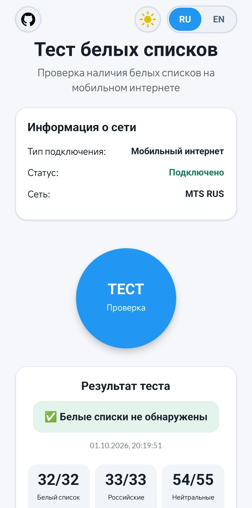
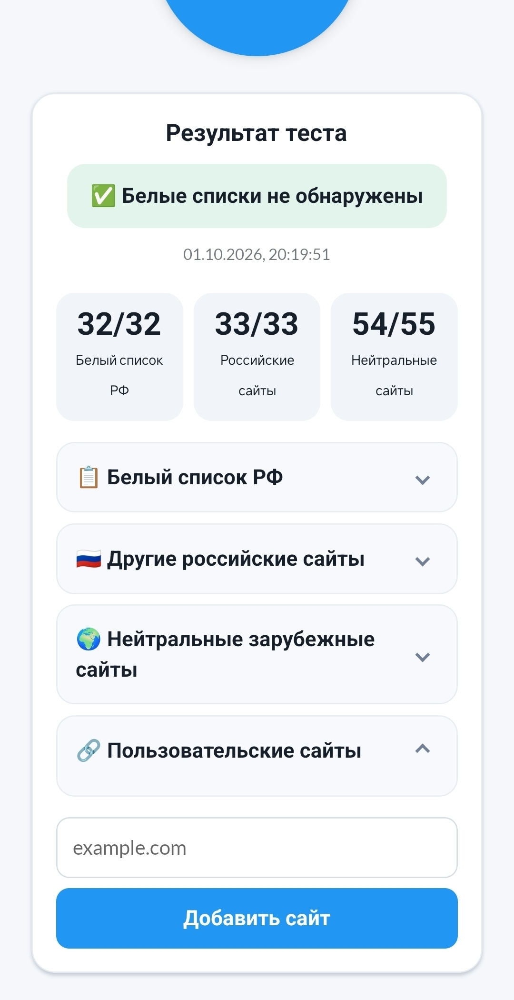
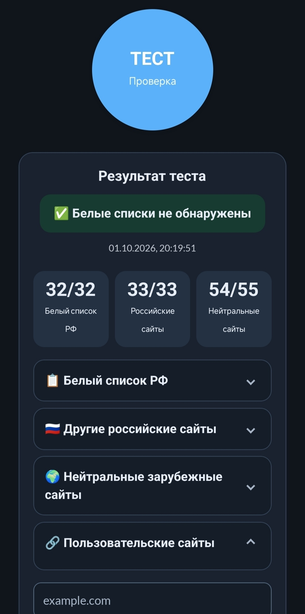

# 📱 Проверка белых списков

Мобильное приложение для проверки белых списков, разработанное на **React Native** с использованием **Expo**.

<p align="center">
  
</p>

## 🚀 Возможности

- ⚡Проверка белых списков по доменам
- 🎨 Современный интерфейс с навигацией
- ⚡ Оптимизированная производительность
- 🌐 Русский и английский интерфейс: при первом запуске язык системы `ru` включает русский, любой другой — английский. Переключатель RU / EN справа сверху сохраняет выбор для следующих запусков и фоновых уведомлений.
- ☀️ Кнопка слева от языков переключает светлую и тёмную темы после вращения иконки. Выбор сохраняется; до первого переключения используется тема системы. При включённом уменьшении движения тема меняется без анимации.

Локализация использует `expo-localization`. После обновления зависимостей пересоберите
установленную Android/iOS-версию, чтобы подключить нативный модуль.

Тема Android-заставки синхронизируется через локальный модуль `modules/app-theme`.
После его добавления и изменения цветов заставки в `app.json` нужна новая нативная сборка.
Android 12+ сохраняет выбор для системной заставки следующего запуска; при обновлении
со старой версии выбор переносится при первом запуске. На старых Android тема
восстанавливается при создании приложения; самый ранний системный кадр запуска может
следовать теме телефона. На iOS системная заставка следует теме iOS, а сохранённая
тема приложения применяется до показа интерфейса React.

## 📦 Релиз

🔗 **[Последний релиз](../../releases/latest)** — скачайте последнюю стабильную версию

### История версий

Все релизы доступны в разделе [Releases](../../releases).

## 📦 Развертывание

1. Клонируйте репозиторий:

```bash
git clone https://github.com/Aleksey-Kon/white-list-test.git
```

```bash
cd testwhitelist
```

2. Установите зависимости:

```bash
npm install
```

3. Запустите приложение:

```bash
npx expo start
```

## 📱 Запуск на устройствах

Размер release APK уменьшен с 108,81 до 54,83 МиБ сжатием нативных библиотек
с сохранением всех архитектур. [Измерения и проверки содержимого](docs/apk-size-optimization.md).

### Проверка сайтов с ошибками сертификатов

Локальный Expo-модуль `modules/site-probe` выполняет запросы пингера на Android/iOS
с принятием просроченных, самоподписанных и не соответствующих имени сайта
сертификатов. Доступность определяется полученным HTTP-статусом по прежним правилам;
ошибка DNS, таймаут или обрыв соединения не считаются успешной проверкой.
Проверка работает и в фоновом мониторинге. Клиент получает только статус ответа,
не использует общие cookies или хранилище авторизации и не загружает тело страницы.

Редирект (`301`, `302`, `307` и т. п.) считается ответом сайта: пингер не переходит
по нему. Это предотвращает ложную недоступность при циклах перенаправлений
(например, Ozon без браузерных cookies) и ошибках на следующем адресе.
Проверяется ответ исходного сайта, а не успешное открытие конечной страницы.

После этого изменения нужна новая нативная сборка: перезапуска Metro недостаточно.
В Expo Go и старых сборках остаётся обычный `fetch`; браузерная версия также
не может обходить проверку сертификатов. Дополнительные npm-зависимости не нужны.

Плагин `plugins/withSiteProbe.js` разрешает ручную проверку доверия на iOS через
`NSAllowsArbitraryLoads` (ATS отключается на уровне приложения, поскольку домены
задаёт пользователь). Принятие недействительных сертификатов реализовано только
в отдельном `URLSession` пингера; обычные сетевые клиенты сохраняют проверку доверия.
См. [документацию Apple](https://developer.apple.com/documentation/foundation/performing-manual-server-trust-authentication).

Проверка на установленной сборке: добавить `https://expired.badssl.com`,
`https://self-signed.badssl.com` и `https://wrong.host.badssl.com` и выполнить тест
в сети без блокировок. Все три должны получить HTTP-ответ. Затем отключить сеть:
сайты должны стать недоступны. Повторить для фонового мониторинга. Эти проверки
нужны отдельно от Node-тестов, которые мокируют нативный транспорт.

### Development-сборка и холодный фоновый запуск

`npm run build:development` создаёт отдельное приложение с пометкой `(DEV)` и
пакетом `com.zvezda4443.testwhitelist.dev`. Рабочая версия и её данные сохраняются.
Для локальной сборки на Windows с установленными JDK 17 и Android SDK:

```powershell
$env:APP_VARIANT = 'development'
$env:NODE_ENV = 'development'
npx expo prebuild --platform android --no-install
Push-Location android
./gradlew.bat :app:assembleDebug -PreactNativeArchitectures=arm64-v8a
Pop-Location
adb install -r android/app/build/outputs/apk/debug/app-debug.apk
adb reverse tcp:8081 tcp:8081
npx expo start --dev-client --localhost
```

Не проверяйте только сворачивание уже открытого экрана: в этом случае JS-обработчики
уже загружены. Для регрессии холодного запуска включите тест, сверните приложение,
выполните `adb shell am kill com.zvezda4443.testwhitelist.dev`, убедитесь через
`adb shell pidof com.zvezda4443.testwhitelist.dev`, что процесс исчез, затем найдите
текущий JOB_ID и запустите его командой `cmd jobscheduler run -f`, как выше, с DEV-пакетом.
Не используйте `am force-stop`: он останавливает задания, а не имитирует обычную
выгрузку фонового процесса. После успешного запуска повторите проверку с новым JOB_ID.

В Logcat должны появиться `Task defined at JS startup`, `Started`, `Completed`,
`Task successfully finished` и постановка следующего задания без открытия экрана.
Регистрация находится в корневом `index.js`, **до** `expo-router/entry`:
`app/_layout.tsx` не гарантированно выполняется при запуске без Activity.
Если `dumpsys jobscheduler` показывает `not within quota`, Android уже исчерпал
бюджет фонового выполнения: одно исправление JS не обнуляет статистику ОС.
Не считайте принудительный запуск проверкой точности штатного 15-минутного расписания.

### Android

```bash
npm run android
```

### iOS

```bash
npm run ios
```

## 🏗 Структура проекта

```
testwhitelist/
├── app/              # Экраны и маршруты (Expo Router)
├── assets/           # Изображения, шрифты и ресурсы
├── components/       # Переиспользуемые компоненты
├── constants/        # Константы и конфигурация
├── hooks/            # Пользовательские хуки
└── scripts/          # Вспомогательные скрипты
```

## 📸 Скриншоты

<p align="center">
  
</p>

<p align="center">
  
</p>

## 🤝 Вклад

Приветствуется любой вклад в проект! Для начала:

1. Сделайте форк репозитория
2. Создайте ветку для новой функциональности
3. Зафиксируйте изменения
4. Отправьте в ветку
5. Откройте Pull Request

## 📄 Лицензия

Этот проект распространяется под лицензией **MIT**.

Лицензия разрешает:

- ✅ Коммерческое использование
- ✅ Модификацию кода
- ✅ Распространение
- ✅ Частное использование

Единственное требование — **сохранение уведомления об авторских правах** и текста лицензии в копиях проекта.

---

⭐ Если проект был полезен, поставьте звезду!
